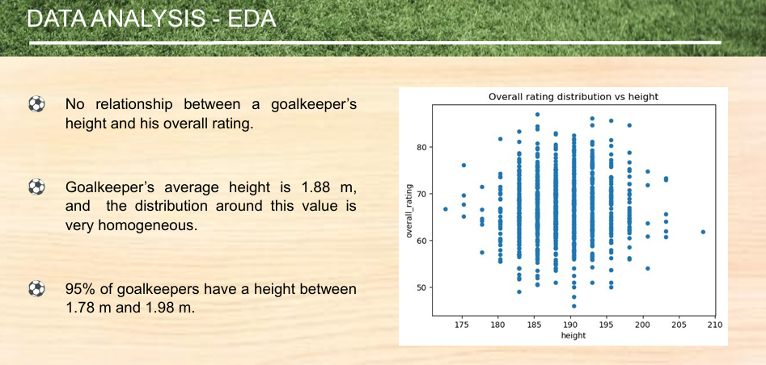

# Football-goalkeeper-analytics
# 🧤 European Football – Does a Goalkeeper's Height Matter?

## 📌 Contexte du projet

Ce projet analyse une question récurrente dans le monde du football : **la taille d'un gardien de but influence-t-elle réellement sa performance et son niveau global (overall rating) ?**

L'analyse s'appuie sur des données de gardiens de but évoluant en football européen, en croisant leur taille avec plusieurs métriques techniques (réflexes, positionnement, plongeon, relance, etc.) afin de déterminer le véritable poids de la taille dans la performance globale.

---

## 🎯 Objectif

Déterminer, à l'aide d'une analyse statistique et de modèles de régression, si la taille est un **facteur déterminant** de la qualité d'un gardien de but, ou si d'autres compétences techniques pèsent davantage dans son niveau global.

---

## 📊 Données clés

| Élément | Valeur |
|---|---|
| **Taille moyenne d'un gardien** | 1,88 m |
| **95 % des gardiens mesurent entre** | 1,78 m et 1,98 m |
| **Taille moyenne d'un homme en Europe** | 1,76 m – 1,80 m |
| **Dimensions d'une cage de football** | 7,32 m x 2,44 m |

**Exemples de grands gardiens :** Buffon (1,93 m), Courtois (1,98 m), Neuer (1,93 m)
**Exemples de gardiens plus petits mais très bien classés :** Casillas (1,85 m – rating 87, 1er), Julio César (1,85 m – rating 84, 7e), Valdés (1,83 m – rating 83, 8e)

---

## 🔍 Insights clés

### 1. Aucune corrélation significative entre taille et niveau global
- L'analyse exploratoire (EDA) ne montre **aucune relation claire entre la taille d'un gardien et son overall rating**.
- La matrice de corrélation confirme ce constat : la taille présente des coefficients de corrélation **très faibles** avec les compétences techniques (diving, handling, kicking, positioning, reflexes), tous inférieurs à 0,06.

### 2. Une distribution des tailles très homogène
- La quasi-totalité des gardiens professionnels se situe dans une **fourchette de taille resserrée** (1,78 m – 1,98 m pour 95 % d'entre eux).
- Cette homogénéité suggère qu'à partir d'un certain seuil de taille, **la différence ne se fait plus sur ce critère physique**, mais sur d'autres qualités.

### 3. Les compétences techniques priment largement sur la taille
- Sur les **3 modèles de régression testés**, le coefficient associé à la taille reste **quasi nul** dans tous les cas, tandis que les réflexes, le positionnement, le plongeon et la relance concentrent l'essentiel du poids explicatif.
- Le modèle final atteint une performance très élevée (**R² train : 0,9931 / R² test : 0,9927**), confirmant que les compétences techniques suffisent à expliquer quasi intégralement le niveau global d'un gardien, **sans besoin d'intégrer la taille comme facteur clé**.

### 4. Des contre-exemples concrets viennent renforcer le constat
- **Casillas (1,85 m)**, plus petit que la moyenne des grands gardiens, est classé **1er** avec un rating de 87 — supérieur à celui de gardiens bien plus grands comme Buffon ou Neuer.
- Cela illustre concrètement que **la taille n'est pas un prérequis indispensable** pour atteindre le plus haut niveau.

---

## 🧠 Conclusion

**La taille d'un gardien de but n'est pas un facteur déterminant de sa performance globale.** Si elle peut apporter un avantage ponctuel (couverture de la cage, jeu aérien), l'analyse montre que ce sont avant tout les **compétences techniques — réflexes, positionnement, plongeon, relance** — qui expliquent le niveau d'un gardien. Des joueurs plus petits que la moyenne peuvent atteindre l'élite mondiale grâce à leur maîtrise technique.

---

## ✅ Recommandations

À partir de ces résultats, plusieurs recommandations peuvent être formulées à destination des clubs, recruteurs et centres de formation :

### 1. Ne pas écarter un jeune gardien sur le seul critère de la taille
Les données montrent qu'un gardien plus petit que la moyenne peut atteindre un niveau d'élite. **Le recrutement et la détection de jeunes talents ne devraient pas se baser en priorité sur des critères morphologiques**, au risque d'écarter des profils techniquement très solides.

### 2. Prioriser l'évaluation des compétences techniques dans les grilles de scouting
Les réflexes, le positionnement et le plongeon expliquent l'essentiel du niveau global. **Les outils de scouting et de notation devraient pondérer davantage ces critères techniques** plutôt que les seules mesures physiques.

### 3. Adapter la formation des jeunes gardiens en conséquence
Plutôt que de concentrer les critères de sélection sur la morphologie, les centres de formation gagneraient à **investir davantage de temps sur le développement technique** (placement, relance, réflexes) dès le plus jeune âge, quel que soit le gabarit du joueur.

### 4. Nuancer selon le style de jeu de l'équipe
La taille peut rester un atout dans des contextes précis (jeu aérien, domination physique sur coups de pied arrêtés). **Une évaluation contextualisée**, tenant compte du système de jeu du club, reste pertinente en complément de l'analyse statistique globale.

---

## 🛠️ Méthodologie & outils
- **Analyse exploratoire des données (EDA)** : distribution de la taille, relation taille / overall rating
- **Matrice de corrélation** entre la taille et les compétences techniques (diving, handling, kicking, positioning, reflexes)
- **Modèles de régression** (3 modèles testés) pour évaluer le poids de chaque variable dans l'overall rating
- **Python** (pandas, scikit-learn, matplotlib/seaborn pour la visualisation)

---

